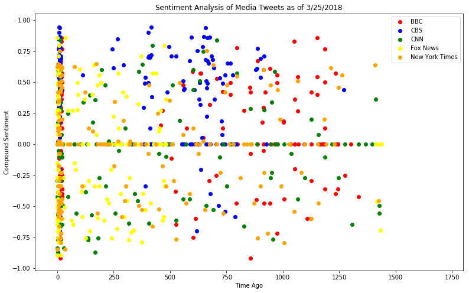
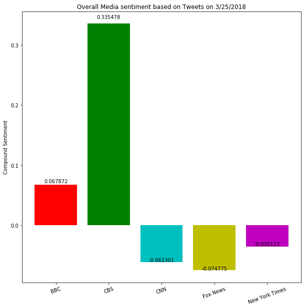

From the data plots it looks like CBS has the most positive sentiments in their news feeds. BBC also has positive sentiments whereas the other news channels overall sentiment is very negative. There was a flood of news feed in the last few minutes(Twitter feed collected at around 10 pm 3/25/2018)

```python
#Dependencies
import numpy as np
import pandas as pd
import tweepy
import time
import json
from datetime import datetime, timezone
import matplotlib.pyplot as plt
from vaderSentiment.vaderSentiment import SentimentIntensityAnalyzer
from config import consumer_key,consumer_secret,access_token,access_token_secret

```


```python
# Twitter API Keys


# Twitter Credentials
auth = tweepy.OAuthHandler(consumer_key, consumer_secret)
auth.set_access_token(access_token, access_token_secret)
api = tweepy.API(auth, parser=tweepy.parsers.JSONParser())

analyzer = SentimentIntensityAnalyzer()
```


```python
##List to hold the news channel
news_channels = ['BBC','CBS','CNN','FoxNews','nytimes']
news_score =[]
current_date = str(datetime.now(timezone.utc).strftime('%Y-%m-%d %H:%M:%S'))
converted_current = datetime.strptime(current_date, '%Y-%m-%d %H:%M:%S')
```


```python
for channels in news_channels:
    
    public_tweets = api.user_timeline("@"+channels,count = 100)
    for tweets in public_tweets:
        creat_time = tweets["created_at"]
        converted_time = datetime.strftime(datetime.strptime(creat_time, "%a %b %d %H:%M:%S %z %Y"),"%Y-%m-%d %H:%M:%S")
        converted_time_str = datetime.strptime(converted_time,"%Y-%m-%d %H:%M:%S")
        time_ago = converted_current - converted_time_str
        time_ago_in_mins = (time_ago.seconds)/60
        compound = analyzer.polarity_scores(tweets["text"])["compound"]
        positive = analyzer.polarity_scores(tweets["text"])["pos"]
        negative = analyzer.polarity_scores(tweets["text"])["neg"]
        neutral = analyzer.polarity_scores(tweets["text"])["neu"]
        news_score.append({"Channel":channels,
                           "Text":tweets["text"],
                           "Compound":compound,
                           "Positive":positive,
                           "Negative":negative,
                           "Neutral":neutral,
                           "Time":time_ago_in_mins})

print("Pass")
news_score_df = pd.DataFrame(news_score) 
```

    Pass
    


```python
news_score_df.to_csv("News Feed Data.csv")
```


```python
bbc_score = news_score_df.loc[news_score_df["Channel"] == "BBC",:]
cbs_score =news_score_df.loc[news_score_df["Channel"] == "CBS",:]
cnn_score =news_score_df.loc[news_score_df["Channel"] == "CNN",:] 
fox_score =news_score_df.loc[news_score_df["Channel"] == "FoxNews",:] 
nyt_score =news_score_df.loc[news_score_df["Channel"] == "nytimes",:]

plt.figure(figsize=(13,8))
bbc = plt.scatter(bbc_score["Time"],bbc_score["Compound"],marker='o', color ='red',label='BBC')
cbs = plt.scatter(cbs_score["Time"],cbs_score["Compound"],marker='o', color ='blue',label ='CBS')
cnn = plt.scatter(cnn_score["Time"],cnn_score["Compound"],marker='o', color ='green',label ='CNN')
fox = plt.scatter(fox_score["Time"],fox_score["Compound"],marker='o', color ='yellow',label = 'Fox News')
nyt = plt.scatter(nyt_score["Time"],nyt_score["Compound"],marker='o', color ='orange', label = 'New York Times')
plt.legend(handles=[bbc,cbs,cnn,fox,nyt],loc='upper right')
plt.xlabel("Time Ago")
plt.ylabel("Compound Sentiment")
plt.title("Sentiment Analysis of Media Tweets as of 3/25/2018")
plt.xlim(-100,1800)
plt.show()
```





```python
av_compound = []
av_compound.append(bbc_score["Compound"].mean())
av_compound.append(cbs_score["Compound"].mean())
av_compound.append(cnn_score["Compound"].mean())
av_compound.append(fox_score["Compound"].mean())
av_compound.append(nyt_score["Compound"].mean())
news = ["BBC","CBS","CNN","Fox News","New York Times"]
my_colors = 'rgcym'
fig,ax= plt.subplots(figsize=(10, 10))
result = ax.bar(news,av_compound,color=my_colors)
plt.xticks(rotation = 20)
plt.ylabel("Compound Sentiment")
plt.title("Overall Media sentiment based on Tweets on 3/25/2018")
def autolabel(rects):
    # attach some text labels
    for rect in rects:
        height = rect.get_height()
        ax.text(rect.get_x()+rect.get_width()/2.,1.02*height,
                '%f' % height,
                ha='center', va='bottom')
autolabel(result)
plt.show()
```




